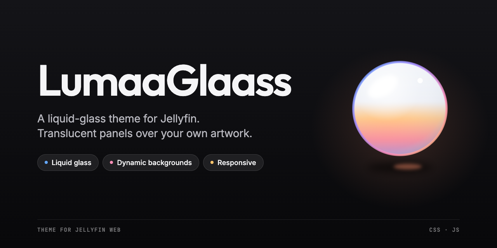

<p align="center">
  
</p>

<p align="center">
  A liquid-glass theme for Jellyfin: translucent panels over your own artwork,
  dynamic backgrounds and a responsive interface.
</p>

<p align="center">
  
  
  
</p>

<p align="center">
  <a href="#features">Features</a> · <a href="#compatibility">Compatibility</a> · <a href="#installation">Installation</a> ·
  <a href="docs/customization.md">Customization</a> · <a href="#credits">Credits</a>
</p>

## Credits

- Based on [Abyss](https://github.com/AumGupta/abyss-jellyfin) by Om Gupta (AumGupta). Parts of
  `assets/lumaaglaass.css` still derive from Abyss; its MIT copyright notice is kept in
  [LICENSE](LICENSE).

## Features

- **Glass interface** - Smoked-glass panels, rounded controls, and subtle hover effects.
- **Responsive layouts** - Readable titles, balanced spacing, and neatly arranged mobile actions.
- **Home banner** - Rotating artwork, touch gestures, and playback shortcuts; optionally hide the banner while keeping a still media background.
- **Dynamic backgrounds** - Media artwork for home and libraries; search and settings reuse the last successfully loaded background.
- **Focused search** - A simplified search page without visible suggestions.
- **Refined controls** - Version, audio, and subtitle selectors with clear favorite and watched states.
- **Accessibility preferences** - Reduced-motion, reduced-transparency, more-contrast and forced-colors styles.
- **Per-account settings** - An optional settings page for theme appearance and features, saved with each Jellyfin account.
- **Easy customization** - One line each for the accent color, the roundness of every corner, the glass, spacing, font and animation speed; see [Theme variables](docs/customization.md#theme-variables).
- **Localized labels** - Follow Jellyfin's selected language, with English as a fallback for missing translations.

## Compatibility

Designed for and tested on **Polyfin**, and also tested on **Remux**. Both serve
**Jellyfin Web 12.1**, the interface the theme is built for, so it is meant for any
server that serves Jellyfin Web 12.1.x; servers other than these two have not been
tested. Earlier Jellyfin Web versions are not supported.

Use the **Dark** base theme and a modern browser.

## Installation

No download or installer is required. Back up your existing Custom CSS and
Custom JavaScript before replacing the theme.

### Polyfin

**1. Apply the stylesheet**

Open **Polyfin → Settings → Web player → Custom CSS** and replace your previous
theme with:

```css
@import url('https://cdn.jsdelivr.net/gh/Dyhlio/LumaaGlaass@main/assets/lumaaglaass.css');
```

Keep the import at the top, before any personal CSS overrides. Do not combine
it with another theme or a second copy of this stylesheet.

Alternatively, open [lumaaglaass.css](assets/lumaaglaass.css), copy the full file,
and paste it into **Custom CSS** instead of using the import.

**2. Add the JavaScript**

Paste this loader into **Custom JavaScript**, on the same page, without `<script>`
tags. Replace the previous LumaaGlaass script or loader, and preserve unrelated
scripts:

```js
(() => {
    window.LumaaGlaassOptions = {
        preferences: false,
        homeCarousel: true,
        collectionFilter: true
    };

    const id = 'lg-script';
    if (document.getElementById(id)) return;

    const script = document.createElement('script');
    script.id = id;
    script.src = 'https://cdn.jsdelivr.net/gh/Dyhlio/LumaaGlaass@main/assets/lumaaglaass.js';
    script.onerror = () => {
        script.remove();
        console.error('LumaaGlaass could not be loaded.');
    };

    document.head.appendChild(script);
})();
```

The configuration above shows the exact defaults: `preferences` is `false`,
while `homeCarousel` and `collectionFilter` are `true`. Set
`homeCarousel: false` in this loader to hide the home carousel while keeping a
still media background, then save and fully reload. See [Home carousel](docs/customization.md#home-carousel)
for background behavior. No additional loader is needed.

Collections mixing movies and series show All / Movies / Shows by default. Set
`collectionFilter: false` in the same loader to disable the filter; see
[Collection filter](docs/customization.md#collection-filter).

Alternatively, open [lumaaglaass.js](assets/lumaaglaass.js), copy the full file, and paste
it into **Custom JavaScript** instead of the loader. Use only one method, not both.
For a pasted copy, place the configuration before the script, for example
`window.LumaaGlaassOptions = { preferences: true, homeCarousel: false };` to
enable the settings page and disable the carousel.
The CSS import does not load JavaScript; both installation steps are required.

Change `preferences` to `true` to add **Settings → LumaaGlaass** in the web client. There,
each account can choose the theme appearance and optional features. No separate
extension loaders or CSS imports are needed when using this settings page. Its
default is `false` so omitting it keeps the existing fixed Custom JavaScript and
Custom CSS configuration unchanged.

**3. Save and reload**

Save both fields, select Jellyfin's **Dark** base theme, and fully reload the
client. On desktop, use **Ctrl+F5** if the previous styling remains.

Once the theme is installed, see the [customization guide](docs/customization.md)
to enable optional features or adjust its appearance. It includes copy-and-paste
instructions and explains which options can be combined.

On another server that serves Jellyfin Web 12.1, paste the same code into its own
Custom CSS and Custom JavaScript settings.

### Updating or removing

The CDN URLs follow `main`, so you do not need to paste the full files again when
the theme changes. Fully reload the client to load updates. CDN caching can delay
updates and the two files may not refresh at exactly the same time.

For a stable installation, replace `main` in **both URLs** with the same published
commit SHA or release tag. Do not use a tag before it exists in the repository.

If you installed by copying the full files, replace both together when updating.

To remove LumaaGlaass, restore your backed-up CSS and JavaScript configuration.

## Repository

```text
LumaaGlaass/
├── assets/
│   ├── lumaaglaass.css
│   ├── lumaaglaass.js
│   └── extensions/
│       ├── hide-count-indicators.css
│       ├── media-actions.js
│       ├── player-controls.js
│       ├── preferences.css
│       ├── preferences.js
│       └── source-selection.js
├── docs/
│   ├── assets/
│   │   ├── lumaaglaass-banner.png
│   │   ├── lumaaglaass.ico
│   │   ├── lumaaglaass.png
│   │   └── lumaaglaass.svg
│   └── customization.md
├── LICENSE
└── README.md
```

The main theme lives in `assets/` and the optional extensions in `assets/extensions/`.
Every file is used as-is, with no build step; jsDelivr serves them straight from this
repository.

## Notes

- Search and settings reuse the last background loaded during the session (home,
  a library, a collection or a details page). Opening search directly or reloading
  it uses a neutral background until one has been loaded.
- Artwork comes from your Jellyfin server. No external font loader or analytics is bundled.

## License

Released under the [MIT License](LICENSE). The license also carries the notice of
Abyss (Om Gupta) for the parts of the stylesheet derived from it (see
[Credits](#credits)). Keep both notices when redistributing the theme or a copy of
its stylesheet.
